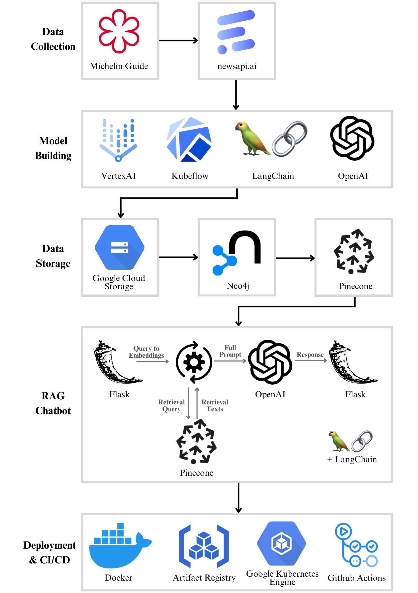

# Data Engineering Individual Project: Supply Chain Relationship Analysis Using RAG Chatbot

## Project Introduction

This project harnesses advanced AI technologies to develop a Retrievable Augmented Generative (RAG) chatbot that efficiently identifies supplier-buyer relationships from news articles. By extracting news data using APIs and employing named entity recognition and relations extraction through OpenAI's large language models, this system provides a powerful tool for sustainability consultants. The data is processed using Kubeflow and Vertex AI, stored in a Neo4j graph database, and further organized in a Pinecone vector database. This structured data flow enables the RAG chatbot, designed with LangChain, to provide rapid and accurate queries aiding consultants in crafting detailed, timely reports for clients.

## System Architecture Diagram

## Objectives

- Create and deploy a RAG using OpenAI's LLM for enhanced information retrieval.
- Employ a variety of cloud-based tools and technologies including Kubeflow, Vertex AI, and Docker.
- Establish replicable environments and manage dependencies efficiently using Docker.
- Implement version control using Git to manage and track project developments.
- Effectively evaluate RAGs using various methodologies.
- Serve the model through a Flask API endpoint to interact with users.

## Key Scripts

- `kfp_pipeline.py`: Orchestrates the data pipeline for named entity recognition and relationship extraction.
- `lang_chain_embeddings_rag.ipynb`: Jupyter notebook for exploring various RAG configurations and features.
- `rag_memory_end_point.py`: Flask API endpoint script for serving the RAG chatbot.
- `Google.yml`: GitHub Actions workflow file crucial for the CI/CD pipeline.

## Tools and Technologies

- **Data Extraction and Processing**: Kubeflow, Vertex AI
- **Named Entity Recognition and Relation Extraction**: OpenAI's LLM
- **Databases**: Neo4j (Graph Database), Pinecone (Vector Database)
- **Programming and Scripting**: Python, Jupyter Notebook
- **Containerization and Version Control**: Docker, GitHub Actions
- **Deployment**: Google Kubernetes Engine, Artifact Registry, Flask API
- **Other Technologies**: Google Cloud Storage, LangChain

## Setup and Installation Requirements

Each component of the project is containerized using Docker, managed by specific requirements.txt files corresponding to the different Dockerfiles (`requirements.txt`, `requirements_2.txt`, `requirements_3.txt`). The repository includes scripts to automate the deployment process (`run_pipeline.sh`, `submit_or_scripts.sh`) and Dockerfiles tailored for different segments of the project.

## Project Structure

### Data Collection
- `1_data_collection/get_news_api_data/final_get_api_news_data.py`: Script for fetching news data related to Michelin-star restaurants.

### Vertex AI and Kubeflow Integration
- `2_vertex_AI/kfp_pipeline.py`: Pipeline script for executing named entity recognition and relation extraction processes.

### Graph Database Transformation
- `4_graph_database/transform_and_write_to_neo4j.py`: Script for data transformation and storage into Neo4j database.

### Vector Database Integration
- `5_vector_database/`: Contains scripts for index creation, cluster retrieval, and embeddings management.

### LangChain and RAG Integration
- `6_langchain_and_rag/langchain_embeddings_rag.ipynb`: Jupyter notebook for experimenting with different LangChain features and RAG configurations.

### RAG Approaches
- `7_rag_approaches/`: Focuses on three subfolders: `rag_evaluation`, `rag_with_neo4j`, and `three_rag_options` containing critical scripts `rag_pipeline_1.py`, `rag_chain_2.py`, `rag_memory_3.py`, and evaluation scripts `rag_eval_final.py`.

### API Endpoint
- `8_rag_api_end_point_flask/rag_memory_end_point.py`: Flask API endpoint script for the most effective RAG chatbot version, facilitating user interactions.

## Additional Key Components

- **Shell Scripts**: `run_pipeline.sh` and `submit_or_scripts.sh` for automating pipeline and script submission processes.
- **Dockerfiles**: Organized to support different segments of the workflow, ensuring replicability and consistency.
- **CI/CD Integration**: `google.yml` in `.github/workflows` directory, vital for automating builds and deployments via GitHub Actions, connected to Google Artifact Registry and Kubernetes Engine.
- **Failed Attempts and Learning**: `cloud_build.yaml` included to showcase attempted builds that provide learning opportunities.
